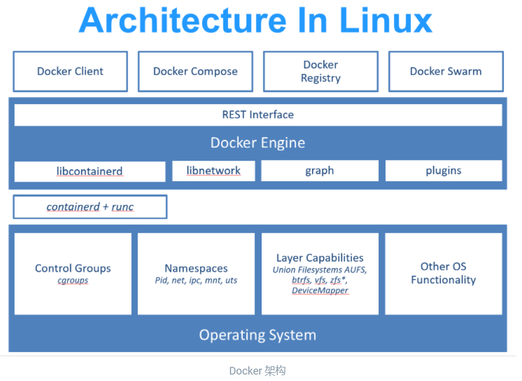

<!-- vscode-markdown-toc -->
* 1. [什么是Docker](#Docker)
* 2. [为什么要用Docker](#Docker-1)
* 3. [镜像（Image）](#Image)
* 4. [容器（Container）](#Container)
* 5. [仓库（Repository）](#Repository)
* 6. [从仓库获取镜像](#)
* 7. [管理本地主机上的镜像](#-1)
* 8. [启动](#-1)

<!-- vscode-markdown-toc-config
	numbering=true
	autoSave=true
	/vscode-markdown-toc-config -->
<!-- /vscode-markdown-toc -->
学习网址：https://yeasy.gitbook.io/docker_practice/

# Docker简介
##  1. <a name='Docker'></a>什么是Docker
  
* Docker
  * 使用Go语言进行开发实现；
  * 基于Linux内核的cgroup，namespace，以及OverlayFS类的Union FS等技术，对进程进行封装隔离；
  * 属于操作系统层面的虚拟化技术。
  * 由于隔离的进程独立于宿主和其他的隔离的进程，因此也称其为容器。
  * 最初实现是基于LXC，从0.7版本以后开始去除LXC，转而使用自行开发的libcontainer，从1.11版本开始，则进一步演进为使用runC和contained。
    * runc是一个Linux命令行工具，用于根据OCI容器运行时规范创建和运行容器。
    * contained是一个守护程序，它管理容器生命周期，提供了在一个节点上执行容器和管理镜像的最小功能集
  * Docker在容器的基础上，进行了进一步的封装，从文件系统、网络互联到进程隔离等等，极大的简化了容器的创建和维护。使得Docker技术比虚拟机技术更为轻便、快捷。

* Docker和传统虚拟化方式的不同之处：
  * 传统虚拟机技术是虚拟出一套硬件后，在其上运行一个完整操作系统，在该系统上再运行所需应用进程；
  * 容器内的应用进程直接运行于宿主的内核，容器内没有自己的内核，而且也没有进行硬件虚拟。因此容器要比传统虚拟机更为轻便。


##  2. <a name='Docker-1'></a>为什么要用Docker
Docker跟传统的虚拟化方式相比具有众多的优势：
* 更高效的利用系统资源  
  原因：容器不需要进行硬件虚拟以及运行完整操作系统等额外开销。  
  结果：一个相同配置的主机，往往可以运行更多数量的应用
* 更快速的启动时间  
  Docker容器应用，由于直接运行于宿主内核，无需启动完整的操作系统，因此可以做到秒级、甚至毫秒级的启动时间。（传统：往往需要数分钟）
* 一致的运行环境  
  由于开发环境、测试环境、生产环境不一致，导致有些 bug 并未在开发过程中被发现。而 Docker 的镜像提供了除内核外完整的运行时环境，确保了应用运行环境一致性。
* 持续交付和部署  
  使用 Docker 可以通过定制应用镜像来实现持续集成、持续交付、部署。开发人员可以通过 Dockerfile 来进行镜像构建，并结合 持续集成(Continuous Integration) 系统进行集成测试，而运维人员则可以直接在生产环境中快速部署该镜像，甚至结合 持续部署(Continuous Delivery/Deployment) 系统进行自动部署。
* 更轻松的迁移  
  由于 Docker 确保了执行环境的一致性，使得应用的迁移更加容易。Docker 可以在很多平台上运行，无论是物理机、虚拟机、公有云、私有云，甚至是笔记本，其运行结果是一致的。
* 更轻松的维护和扩展  
  Docker 使用的分层存储以及镜像的技术，使得应用重复部分的复用更为容易，也使得应用的维护更新更加简单，基于基础镜像进一步扩展镜像也变得非常简单。
* 总结：  
    


# 基本概念
##  3. <a name='Image'></a>镜像（Image） 
  * 操作系统分为内核和用户空间
  * 对于Linux，内核启动后，会挂载root文件系统为其提供用户空间支持
  * Docker镜像（Image）  
    * 相当于是一个root文件系统。  
      比如官方镜像 ubuntu:18.04 就包含了完整的一套 Ubuntu 18.04 最小系统的 root 文件系统。
    * Docker镜像是一个特殊的文件系统
      * 提供容器运行时所需的程序、库、资源、配置等文件；
      * 包含一些为运行时准备的一些配置参数（如匿名卷、环境变量、用户等）
      * 不包含任何动态数据，其内容在构建之后也不会被改变。
  * 分层存储
    * 因为镜像包含操作系统完整的 root 文件系统，其体积往往是庞大的，因此在 Docker 设计时，就充分利用 Union FS 的技术，将其设计为分层存储的架构。
      * 所以严格来说，镜像是由一组文件系统组成，或者说，由多层文件系统联合组成。
      * 镜像构建时，会一层层构建，前一层是后一层的基础。
      * 每一层构建完就不会再发生改变，后一层上的任何改变只发生在自己这一层。
        * 比如，删除前一层文件的操作，实际不是真的删除前一层的文件，而是仅在当前层标记为该文件已删除。
        * 因此，在构建镜像的时候，需要额外小心，每一层尽量只包含该层需要添加的东西，任何额外的东西应该在该层构建结束前清理掉。
    * 分层存储的特征使得镜像的复用、定制变的更为容易。
      * 甚至可以用之前构建好的镜像作为基础层，然后进一步添加新的层，以定制自己所需的内容，构建新的镜像。
##  4. <a name='Container'></a>容器（Container）
  * 镜像和容器的关系
    * 就像是面向对象程序设计中的类和实例一样，镜像是静态的定义，容器是镜像运行时的实体。
    * 容器可以被创建、启动、停止、删除、暂停等
  * 容器的实质是进程
    * 与直接在宿主执行的进程不同
      * 容器进程运行于属于自己的独立的命名空间  
        因此容器可以拥有自己的 root 文件系统、自己的网络配置、自己的进程空间，甚至自己的用户 ID 空间。
  * 容器内的进程是运行在一个隔离的环境里，使用起来，就好像是在一个独立于宿主的系统下操作一样。
    * 使得容器封装的应用比直接在宿主运行更加安全。
  * 容器使用的也是分层存储
    * 容器存储层  
      * 每一个容器运行时，是以镜像为基础层，在其上创建一个当前容器的存储层，我们可以称这个为容器运行时读写而准备的存储层为 容器存储层。
      * 容器存储层的生存周期和容器一样，容器消亡时，容器存储层也随之消亡。
        * 任何保存于容器存储层的信息都会随容器删除而丢失。
        * 按照 Docker 最佳实践的要求，容器不应该向其存储层内写入任何数据，容器存储层要保持无状态化。
        * 所有的文件写入操作，都应该使用 数据卷（Volume）、或者 绑定宿主目录，在这些位置的读写会跳过容器存储层，直接对宿主（或网络存储）发生读写，其性能和稳定性更高。
            * 数据卷的生存周期独立于容器，容器消亡，数据卷不会消亡。
              * 因此，使用数据卷后，容器删除或者重新运行之后，数据却不会丢失。
##  5. <a name='Repository'></a>仓库（Repository）
  * Docker Registry
    * 一个集中的存储、分发镜像的服务
      使用场景：镜像构建完成后，可以很容易的在当前宿主机上运行，但是，如果需要在其它服务器上使用这个镜像时
    * 一个 Docker Registry 中可以包含多个仓库（Repository）
    * 每个仓库可以包含多个标签（Tag）
    * 每个标签对应一个镜像。
    * 通常，一个仓库会包含同一个软件不同版本的镜像，而标签就常用于对应该软件的各个版本。我们可以通过 <仓库名>:<标签> 的格式来指定具体是这个软件哪个版本的镜像。如果不给出标签，将以 latest 作为默认标签。
    * 仓库名经常以 两段式路径 形式出现，比如 jwilder/nginx-proxy，前者往往意味着 Docker Registry 多用户环境下的用户名，后者则往往是对应的软件名。但这并非绝对，取决于所使用的具体 Docker Registry 的软件或服务。
  * Docker Registry公开服务
    * 开放给用户使用、允许用户管理镜像的 Registry 服务。  
      一般这类公开服务允许用户免费上传、下载公开的镜像，并可能提供收费服务供用户管理私有镜像。
    * 最常使用的 Registry 公开服务是官方的 Docker Hub
      * 这是默认的 Registry
      * 拥有大量的高质量的官方镜像
      * Red Hat 的 Quay.io；Google 的 Google Container Registry，Kubernetes 的镜像使用的就是这个服务；代码托管平台 GitHub 推出的 ghcr.io。
      * 加速器
        * 国内的一些云服务商提供了针对 Docker Hub 的镜像服务（Registry Mirror），这些镜像服务被称为 加速器。
        * 常见的有 阿里云加速器、DaoCloud 加速器 等。使用加速器会直接从国内的地址下载 Docker Hub 的镜像，比直接从 Docker Hub 下载速度会提高很多。
    * 国内也有一些云服务商提供类似于 Docker Hub 的公开服务。比如 网易云镜像服务、DaoCloud 镜像市场、阿里云镜像库 等。
  * 私有Docker Registry
    * 用户可以在本地搭建私有 Docker Registry
    * Docker 官方提供了 Docker Registry 镜像，可以直接使用做为私有 Registry 服务。
      * 开源的 Docker Registry 镜像只提供了 Docker Registry API 的服务端实现，足以支持 docker 命令，不影响使用。
      * 不包含图形界面，以及镜像维护、用户管理、访问控制等高级功能。
    * 除了官方的 Docker Registry 外，还有第三方软件实现了 Docker Registry API，甚至提供了用户界面以及一些高级功能。比如，Harbor 和 Sonatype Nexus。

# 安装Docker
Docker分为stable、 test和nightly三个更新频道
* 我的操作系统版本  
  版本	Windows 10 家庭中文版  
  版本号	21H2  
  安装日期	‎2021/‎9/‎29  
  操作系统内部版本	19044.1706  
  体验	Windows Feature Experience Pack 120.2212.4170.0
* 安装
  * 点击链接下载：https://desktop.docker.com/win/main/amd64/Docker%20Desktop%20Installer.exe
  * 双击exe文件开始安装
* 运行
  * 在 Windows 搜索栏输入 Docker 点击 Docker Desktop 开始运行。
  * Docker 启动之后会在 Windows 任务栏出现鲸鱼图标。
  * 等待片刻，当鲸鱼图标静止时，说明 Docker 启动成功，之后你可以打开 PowerShell 使用 Docker。
* 镜像加速器
  * 任务栏托盘 Docker 图标内右键菜单选择 Settings
  * 打开配置窗口后在左侧导航菜单选择 Docker Engine，
  * 在右侧像下边一样编辑 json 文件：
  ```
  {
    "registry-mirrors": [
      "https://hub-mirror.c.163.com",
      "https://mirror.baidubce.com"
    ]
  }
  ```
  * 之后点击 Apply & Restart 保存后 Docker 就会重启并应用配置的镜像地址了。
  * 在Powershell中执行docker info来检测加速器是否生效。如果从结果中看到了如下内容，说明配置成功。
  ```
  Registry Mirrors:
    https://hub-mirror.c.163.com/
  ```

* 开启实验特性
  一些docker命令或功能仅当实验特性开启时才能使用。  
  从 v20.10 版本开始，Docker CLI 所有实验特性的命令均默认开启，无需再进行配置或设置系统环境变量。

# 使用镜像
Docker 运行容器前需要本地存在对应的镜像，如果本地不存在该镜像，Docker 会从镜像仓库下载该镜像。
##  6. <a name=''></a>从仓库获取镜像
* 从 Docker 镜像仓库获取镜像的命令是 docker pull
```
$ docker pull [选项] [Docker Registry 地址[:端口号]/]仓库名[:标签]
比如：  
$ docker pull ubuntu:18.04
```
  * 具体的选项可以通过 docker pull --help 命令看到
  * Docker 镜像仓库地址：地址的格式一般是 <域名/IP>[:端口号]。默认地址是 Docker Hub(docker.io)。
  * 仓库名：如之前所说，这里的仓库名是两段式名称，即 <用户名>/<软件名>。对于 Docker Hub，如果不给出用户名，则默认为 library，也就是官方镜像。

* 运行
  * 有了镜像后，我们就能够以这个镜像为基础启动并运行一个容器。
  * 以上面的 ubuntu:18.04 为例，如果我们打算启动里面的 bash 并且进行交互式操作的话，可以执行下面的命令。
    ```
    $ docker run -it --rm ubuntu:18.04 bash
    ```
    * docker run 就是运行容器的命令
    * exit退出容器
##  7. <a name='-1'></a>管理本地主机上的镜像
* 列出已经下载的镜像
  ```
  $ docker image ls
  ```
* 查看镜像、容器、数据卷所占用的空间
  ```
  $ docker system df
  ```
* 虚悬镜像
  * 既没有仓库名，也没有标签，均为 <none>
  * 由于新旧镜像同名，旧镜像名称被取消，从而出现仓库名、标签均为 <none> 的镜像。（除了 docker pull 可能导致这种情况，docker build 也同样可以导致这种现象。）
  * 专门显示这类镜像的命令：
    ```
    $ docker image ls -f dangling=true
    ```
  * 可以用下面的命令删除：
    ```
    $ docker image prune
    ```

# 操作容器
##  8. <a name='-1'></a>启动
* 当利用 docker run 来创建容器时，Docker 在后台运行的标准操作包括：
  * 检查本地是否存在指定的镜像，不存在就从 registry 下载
  * 利用镜像创建并启动一个容器
  * 分配一个文件系统，并在只读的镜像层外面挂载一层可读写层
  * 从宿主主机配置的网桥接口中桥接一个虚拟接口到容器中去
  * 从地址池配置一个 ip 地址给容器
  * 执行用户指定的应用程序
  * 执行完毕后容器被终止
* 容器的核心为所执行的应用程序，所需要的资源都是应用程序运行所必需的。除此之外，并没有其它的资源。这种特点使得 Docker 对资源的利用率极高，是货真价实的轻量级虚拟化。